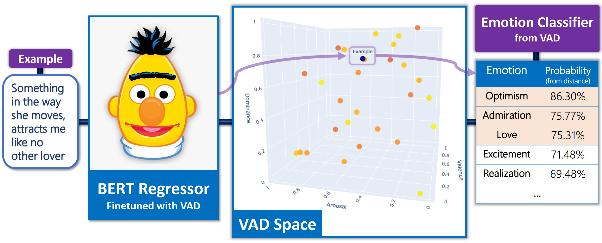

# Emotion Recognition - NLP Final Project

## Introduction
Implementation for the emotion recognition model we present in the paper, was created as part of final-project in NLP course, in TAU.

Our model uses BERT and VAD emotions representations to train an emotion detection model using GoEmotions dataset. 
The model can extract specific emotions from text, as well as their 3D representations (in VAD space). 

#### Model Architecture

#### Paper 
https://github.com/matanbt/emotion-recognition-nlp-project/blob/master/paper-stuff/paper.pdf

## Usage

To train and evaluate a model, simply execute:

 `$ python main.py --config {my-config-file.json}`

Where `config.json` is a configuration file located in `./config`.

- In order to reproduce the paper's experiments you may use the following table:

| Experiment      | Config                   |
| -----------     | -----------              |
| Classification model (baseline)             | `paper_configs/ge_baseline.json`   |
| MAE, 1NN             | `paper_configs/mae.json`   |
| MAE, SVM        | `paper_configs/mae.json`  |
| MSE, 1NN             | `paper_configs/mse.json`        |
| MAE+CE, 1NN           | `paper_configs/mae_ce.json`     
| MAE, VAD scaled, 1NN       | `paper_configs/mae_scaled.json` 
| MAE, VAD scaled, SVM           | `paper_configs/mae_scaled.json`    

## Pipelines Usage

- If you wish to classify your own text by running the model as part of *full pipeline*, use the `single_example_pipeline.py` script 
  (you'll just need to change the constants describing the model).
- If you wish to train and evaluate *full datasets in different ways*, as presented in the paper, use the `zeroshot_pipelines.py` script.

## Directories and Files
- `config`: stores all the (JSON) configurations of experiments we run while writing the paper, baseline includes.
- `notebooks`: directory for all notebooks we write during the research.
- `src`: The code, based on pytorch implementation of GoEmotions baseline.
  - `data_processing`: package to preprocess all sorts of data. `data_loader.py` defines the essential data processor for our datasets.
  - `models`: package defines each model that was used.
  - `train_eval_run`: package that holds all the logic for training the evaluation, and also `run_model.py` which glues the latter two together.
  - `main.py`: CLI entry point to train / evaluate the models. 
- `data`: all the data and mappings we use in this project.
  - `goemotions`: 
    - `emotions.txt`: list of emotions, each line number represent the index of the emotions in GoEmotions dataset.
    - `train.tsv`, `dev.tsv`, `test.tsv`: GoEmotions dataset split done by the paper. 
  - additional datasets we experimented with.
- `paper-stuff`: Visualization of the model and VAD spaces we use in the paper.

## Requirements:

Python 3.8 with the following dependencies:
- torch==1.4.0
- transformers==2.11.0
- datasets
- attrdict==2.0.1
- pandas
- tensorboard
- sklearn

## Acknowledgements
- Original dataset (GoEmotions) and baseline implementation can be found at [Google Research repo](https://github.com/google-research/google-research/tree/master/goemotions).
- We loosely based the core implementation of the model, on the PyTorch GoEmotions baseline implementation by @monologg, in [this repo](https://github.com/monologg/GoEmotions-pytorch).
- We found much use in the unified collection of emotions-related datasets, in [this repo](https://github.com/sarnthil/unify-emotion-datasets)
